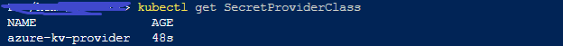
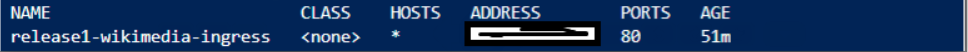

# Deploy Mediawiki appilication into Azure Kubernetes Services
This repo contains the infrastructure and automation scripts of media wiki application
The following procedure was used to automate this application:
 Terraform for creating Azure Kuberenetes Services(AKS), Helm for deploying the application in AKS

```
1. Azure Kuberenetes Services(AKS) is a management and orchestration system for Docker container and container clusters that run within Azure cloud.
2. Terraform is infrastructure management tool
3. Docker is an open platform for developing, shipping, and running applications. Docker enables you to separate your applications from your infrastructure so you can deliver software quickly. 
4. helm is a package manager for kubernetes
```
## Architecture diagram


## Prerequisites
1. Need an Azure account and create a service principle with contributor role ( you can create it by using below cmd
```az ad sp create-for-rbac --name media-wiki-sp --role Contributor ```
2. you will need Terraform(v0.12.21), Helm(3.3.4) and kubectl tools on the Machine using which you will be deploying the cluster.
3. use below commands to login to azure  : az login

## Steps to follow to deploy the Application

### Steps to follow deploy the Azure Kubernetes Services
1. download terraform with version v0.12.21
2. clone this repo
3. navigate to terraform folder
4. replace the variables in tarraform.tfvars with required values
5. run the following cmds 

```
terraform init
terraform plan (to see what resources will be created with this code)
terraform apply

```
now go to the Azure Portal and see if the resources got created

### Set below Configuration to get access to the cluster which was created earlier

1. az account set --subscription <subscription name>
2. az aks get-credentials --resource-group <resource group name> --name <cluster name>

### Install Nginx Ingress Controller
use below commands
 ```
helm repo add ingress-nginx https://kubernetes.github.io/ingress-nginx
helm repo update
helm install ingress-nginx ingress-nginx/ingress-nginx --create-namespace --namespace $Namespace
```
### Steps to Install Secrets Store CSI Driver 
 
```
 az aks enable-addons --addons azure-keyvault-secrets-provider --name myAKSCluster --resource-group myResourceGroup 
```
you can disable it by using az aks disable-addons --addons azure-keyvault-secrets-provider -g myResourceGroup -n myAKSCluster

 ```
 az aks disable-addons --addons azure-keyvault-secrets-provider -g myResourceGroup -n myAKSCluster
 ```

Once this is done. Create secrets in Azure Key Vault for dbname, db-username, db-password, dbrootpasswords. These will be used by application
now use below command
kubectl apply -f azure_SecretProviderClass.yaml

### Steps to follow to install the application

1. go to the repository folder
2. run helm package media-wiki charts
3. the package will be created
4. use this cmd to install the application ```helm install <package name> --name <release name> --namespace <namespace name> ```

You can access the application at http://{ingress publicip}:80/wiki

We can get ingress publicip using below command
```
$ kubectl get ingress -n <namespace name>
```
 
## Below are the some images of the deployment

The following resources got created after the deployment
 

 
 Secret Provider class got created
 
 

 After installing the helm charts, the following got created
 
 Pods
 
  
 
 Services

 
 
 Ingress
 
  
 
 Was able to see the logs in log analytic workspace
  
 After this deployment, once the pods are up and running we can access the web page using Ingress IP address
 
 
 
 
 
